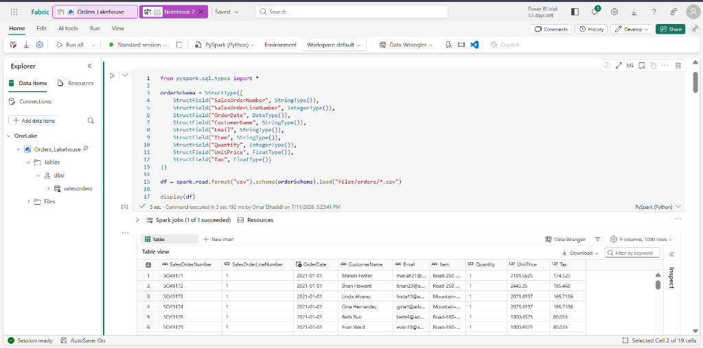
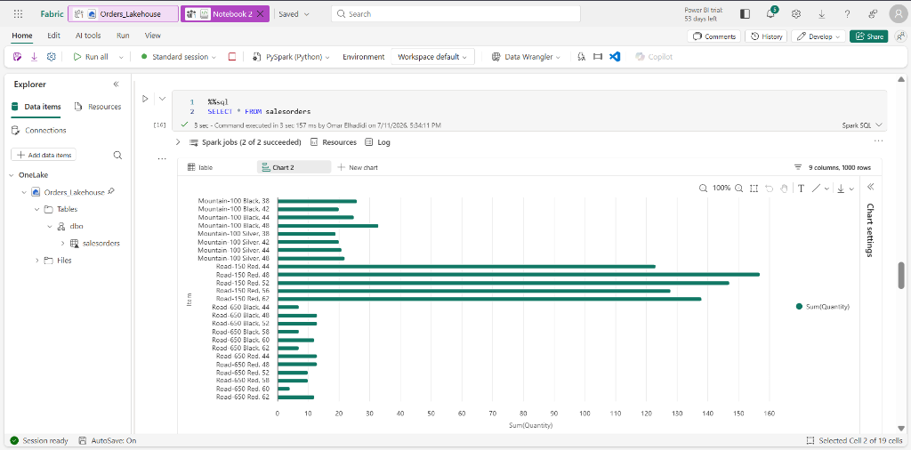
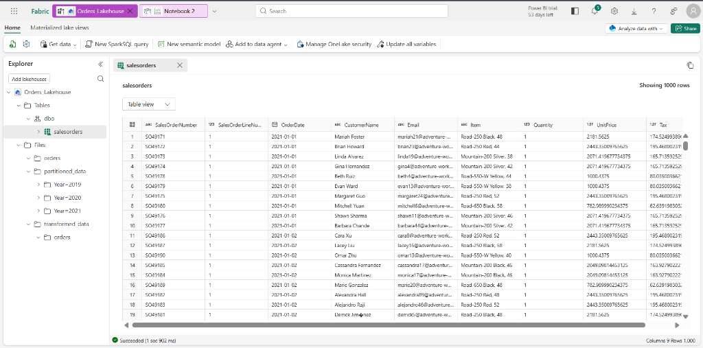

# 🧪 Exercise 3: Analyze Data with Apache Spark in Microsoft Fabric

This exercise walks through ingesting raw sales order text files into a Fabric Lakehouse, loading the files into a Spark DataFrame using an explicit schema, performing transformations, saving data in Parquet and partitioned formats, working with Delta tables, and creating visualizations using built-in tools, Matplotlib, and Seaborn.

---

## 1. Setup & Ingestion
1.  Download the zipped sales files: `https://github.com/MicrosoftLearning/dp-data/raw/main/orders.zip`
2.  Extract the archive to find three files: `2019.csv`, `2020.csv`, and `2021.csv`.
3.  Go to your **Lakehouse Explorer**, under the **Files** folder, create a new folder named `orders`, and upload the three CSV files.

---

## 2. Creating a Notebook & Defining explicit schemas
1.  Open your Lakehouse, and select **Open notebook > New notebook**.
2.  Import Spark SQL types, define the explicit schema to optimize performance, and load all three CSVs using a wildcard (`*`):

```python
from pyspark.sql.types import *

orderSchema = StructType([
    StructField("SalesOrderNumber", StringType()),
    StructField("SalesOrderLineNumber", IntegerType()),
    StructField("OrderDate", DateType()),
    StructField("CustomerName", StringType()),
    StructField("Email", StringType()),
    StructField("Item", StringType()),
    StructField("Quantity", IntegerType()),
    StructField("UnitPrice", FloatType()),
    StructField("Tax", FloatType())
])

# Read all CSV files in the folder
df = spark.read.format("csv").schema(orderSchema).load("Files/orders/*.csv")
display(df)
```

---

## 3. Data Wrangling & Transformations

### Filtering & Selecting Columns
To filter products and return specific subsets of customers who bought the product `'Road-250 Red, 52'`:
```python
customers = df.select("CustomerName", "Email").where(df['Item']=='Road-250 Red, 52')
print(f"Total sales rows: {customers.count()}")
print(f"Unique customers: {customers.distinct().count()}")
display(customers.distinct())
```

### Grouping and Aggregating
Calculate total sales order counts grouped by order year:
```python
from pyspark.sql.functions import *

yearlySales = df.select(year(col("OrderDate")).alias("Year")).groupBy("Year").count().orderBy("Year")
display(yearlySales)
```

### Advanced Schema Transformations
Split strings, derive columns, and reorder dataframes:
```python
# Derive Year/Month columns and split CustomerName into First/Last
transformed_df = df.withColumn("Year", year(col("OrderDate"))) \
                    .withColumn("Month", month(col("OrderDate"))) \
                    .withColumn("FirstName", split(col("CustomerName"), " ").getItem(0)) \
                    .withColumn("LastName", split(col("CustomerName"), " ").getItem(1))

# Select and reorder columns
transformed_df = transformed_df["SalesOrderNumber", "SalesOrderLineNumber", "OrderDate", "Year", "Month", "FirstName", "LastName", "Email", "Item", "Quantity", "UnitPrice", "Tax"]
display(transformed_df.limit(5))
```

---

## 4. Saving Data (Parquet vs. Partitioned Folders)

### Saving to Standard Parquet
```python
transformed_df.write.mode("overwrite").parquet('Files/transformed_data/orders')
```

### Saving with Partitioning
Physical partitioning on OneLake storage by `Year` and `Month`:
```python
transformed_df.write.partitionBy("Year","Month").mode("overwrite").parquet("Files/partitioned_data")
```

### Loading Specific Partition Data
Querying only the partition for 2021 (Notice that `Year` and `Month` columns are omitted in the output DataFrame since they are constant in the folder hierarchy):
```python
orders_2021_df = spark.read.format("parquet").load("Files/partitioned_data/Year=2021/Month=*")
display(orders_2021_df)
```

---

## 5. Working with Delta Tables & Spark SQL
Create a managed Delta table in the Lakehouse catalog and query it directly using Spark SQL cell magics.

```python
# Save DataFrame as a Delta Table
df.write.format("delta").saveAsTable("salesorders")
```

### Run SQL Queries using Cell Magic (`%%sql`)
```sql
%%sql
SELECT YEAR(OrderDate) AS OrderYear,
       SUM((UnitPrice * Quantity) + Tax) AS GrossRevenue
FROM salesorders
GROUP BY YEAR(OrderDate)
ORDER BY OrderYear;
```

---

## 6. Visualizing Spark Data

### Built-in Charts
Run a `SELECT * FROM salesorders` query, click **+ New chart** below the result cell, select **Bar chart**, and set the configuration properties:
*   *X-axis:* Item
*   *Y-axis:* Quantity (Sum)

### Code-Based Visualization (Matplotlib Subplots)
```python
from matplotlib import pyplot as plt

# Matplotlib requires converting the Spark DF to a Pandas DF
df_sales = spark.sql("SELECT CAST(YEAR(OrderDate) AS CHAR(4)) AS OrderYear, \
                             SUM((UnitPrice * Quantity) + Tax) AS GrossRevenue, \
                             COUNT(DISTINCT SalesOrderNumber) AS YearlyCounts \
                      FROM salesorders \
                      GROUP BY CAST(YEAR(OrderDate) AS CHAR(4)) \
                      ORDER BY OrderYear").toPandas()

# Clear plot and configure 2 subplots (1 row, 2 columns)
plt.clf()
fig, ax = plt.subplots(1, 2, figsize = (10,4))

# Bar Chart (Gross Revenue by Year)
ax[0].bar(x=df_sales['OrderYear'], height=df_sales['GrossRevenue'], color='orange')
ax[0].set_title('Revenue by Year')

# Pie Chart (Yearly Order Volume)
ax[1].pie(df_sales['YearlyCounts'])
ax[1].set_title('Orders per Year')
ax[1].legend(df_sales['OrderYear'])

fig.suptitle('Sales Data Analysis')
plt.show()
```

### Visualizing with Seaborn
```python
import seaborn as sns

plt.clf()
sns.set_theme(style="whitegrid")

# Create a Seaborn bar plot
ax = sns.barplot(x="OrderYear", y="GrossRevenue", data=df_sales)
plt.show()
```

---

## 7. Verification Screenshots

### Spark Notebook Execution (PySpark DataFrame Output)


### Spark SQL Query Output


### Populated Delta Table in Lakehouse Tables

