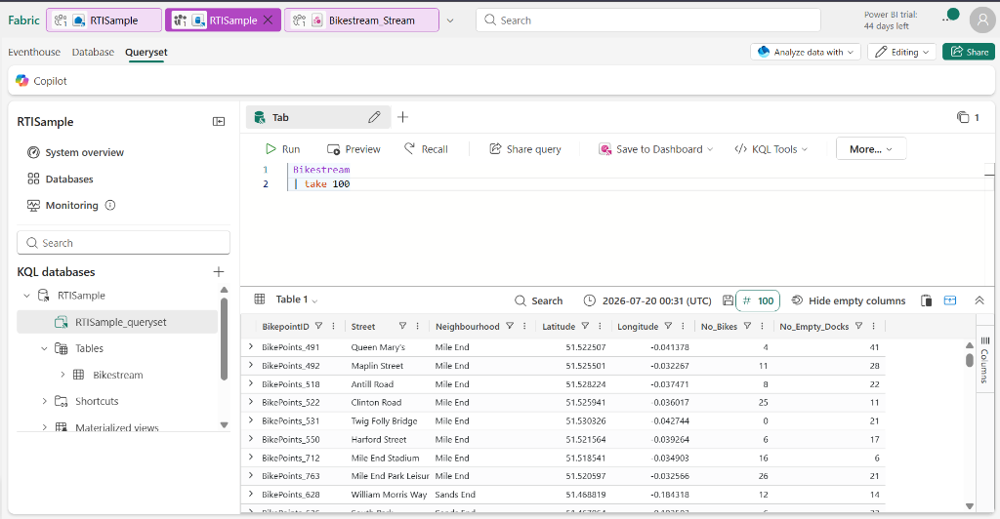
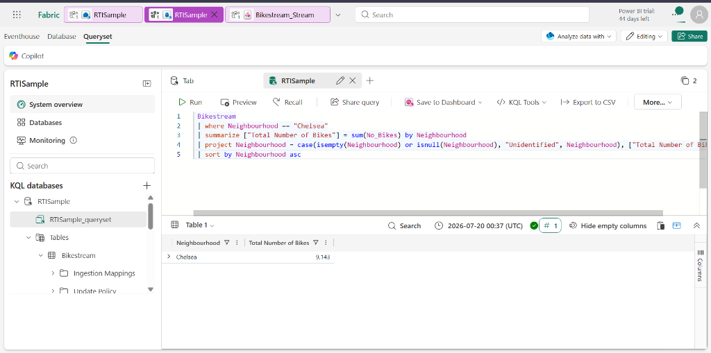
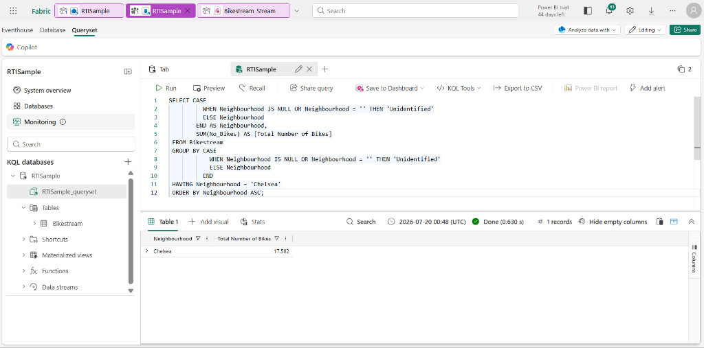

# 🧪 Exercise 4: Work with Data in a Microsoft Fabric Eventhouse

This hands-on exercise explores real-time analytics inside Microsoft Fabric using an Eventhouse, a default KQL database, and KQL querysets. You'll query streaming sample bike data using Kusto Query Language (KQL) and Transact-SQL (T-SQL).

---

## 1. Setup & Sample Eventhouse Ingestion

1. Navigate to the **Real-Time Intelligence** workload in Fabric.
2. Select the **Explore Real-Time Intelligence Sample** tile. 
3. This automatically provisions:
   * An Eventhouse named **`RTISample`**
   * A KQL database named **`RTISample`**
   * A populated table named **`Bikestream`**
   * An attached default KQL queryset

*   *Verification Output:*
    

---

## 2. Query Data using Kusto Query Language (KQL)

Open your queryset in the Eventhouse and run the following queries. KQL is case-sensitive for everything (table names, columns, functions, operators).

### KQL 1: Basic Retrieve (take/limit)
```kql
Bikestream
| take 100
```

### KQL 2: Column Selection & Rename (project)
```kql
Bikestream
| project Street, ["Number of Empty Docks"] = No_Empty_Docks
| take 10
```

### KQL 3: Aggregation (summarize)
Calculate the total number of bikes available:
```kql
Bikestream
| summarize ["Total Number of Bikes"] = sum(No_Bikes)
```

### KQL 4: Grouping & Handling Nulls
Group bike points by neighborhood and map any null/empty neighborhood values to "Unidentified":
```kql
Bikestream
| summarize ["Total Number of Bikes"] = sum(No_Bikes) by Neighbourhood
| project Neighbourhood = case(isempty(Neighbourhood) or isnull(Neighbourhood), "Unidentified", Neighbourhood), ["Total Number of Bikes"]
| sort by Neighbourhood asc
```

### KQL 5: Filter, Aggregate, & Sort
Filter results specifically for the "Chelsea" neighborhood:
```kql
Bikestream
| where Neighbourhood == "Chelsea"
| summarize ["Total Number of Bikes"] = sum(No_Bikes) by Neighbourhood
| project Neighbourhood = case(isempty(Neighbourhood) or isnull(Neighbourhood), "Unidentified", Neighbourhood), ["Total Number of Bikes"]
| sort by Neighbourhood asc
```
*   *Verification Output (Filtered KQL query execution):*
    

---

## 3. Query Data using Transact-SQL (T-SQL)

The KQL Database provides a T-SQL endpoint that emulates SQL Server. It is read-only and does not support DDL/DML (inserts, updates, deletes, tables creation). It is recommended to use KQL for better native performance, but the T-SQL endpoint supports standard client integrations.

### T-SQL 1: Retrieve and Project
```sql
SELECT TOP 10 Street, No_Empty_Docks as [Number of Empty Docks]
FROM Bikestream
```

### T-SQL 2: Grouping & CASE statements (Handling Nulls)
```sql
SELECT CASE
          WHEN Neighbourhood IS NULL OR Neighbourhood = '' THEN 'Unidentified'
          ELSE Neighbourhood
        END AS Neighbourhood,
        SUM(No_Bikes) AS [Total Number of Bikes]
FROM Bikestream
GROUP BY CASE
            WHEN Neighbourhood IS NULL OR Neighbourhood = '' THEN 'Unidentified'
            ELSE Neighbourhood
          END
ORDER BY Neighbourhood ASC;
```

### T-SQL 3: Filter Grouped Data (HAVING)
Filter the grouped data to return Chelsea neighborhood records:
```sql
SELECT CASE
          WHEN Neighbourhood IS NULL OR Neighbourhood = '' THEN 'Unidentified'
          ELSE Neighbourhood
        END AS Neighbourhood,
        SUM(No_Bikes) AS [Total Number of Bikes]
FROM Bikestream
GROUP BY CASE
            WHEN Neighbourhood IS NULL OR Neighbourhood = '' THEN 'Unidentified'
            ELSE Neighbourhood
          END
HAVING Neighbourhood = 'Chelsea'
ORDER BY Neighbourhood ASC;
```
*   *Verification Output (T-SQL query executing against KQL endpoint):*
    
