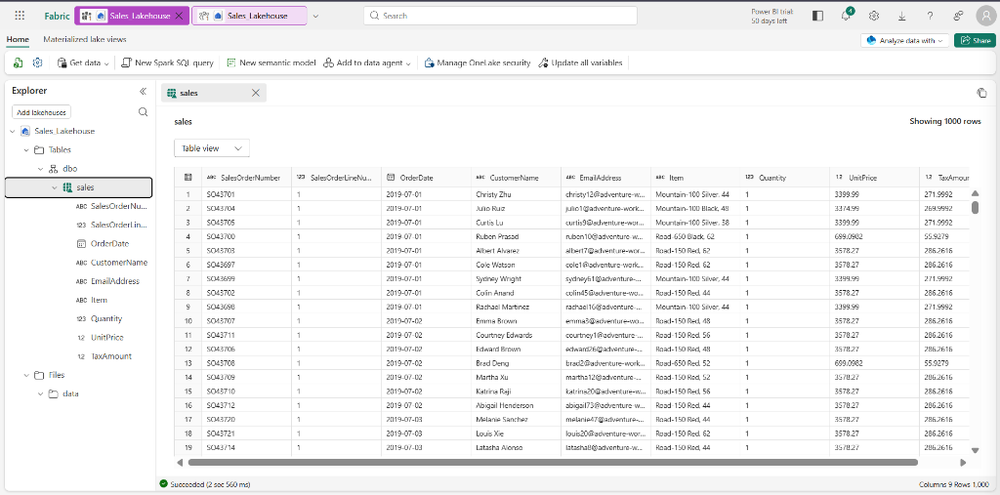
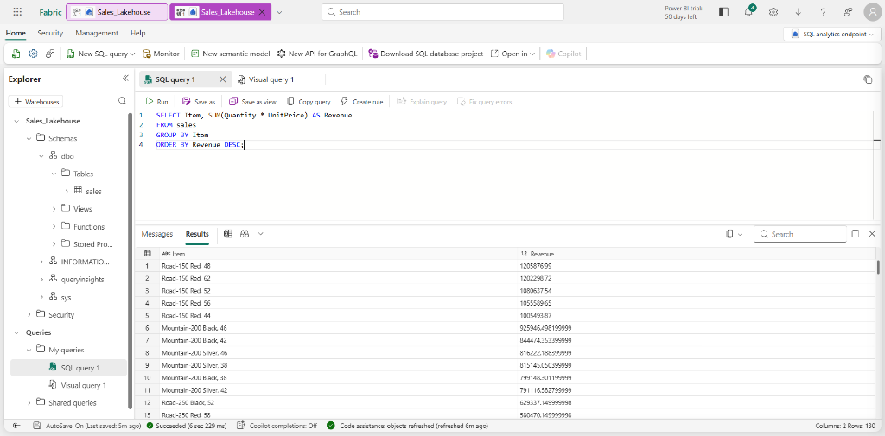
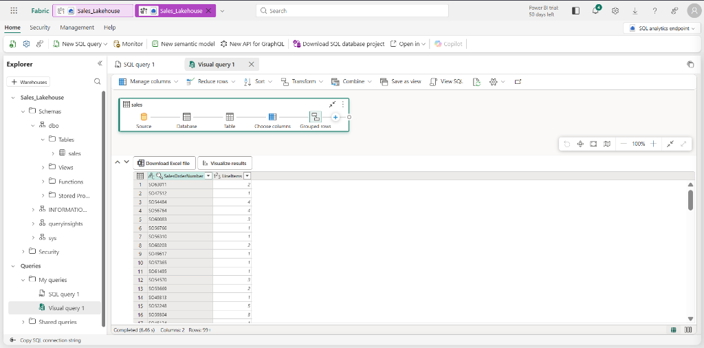

# 🧪 Exercise 6: Create a Microsoft Fabric Lakehouse

This exercise walks through creating a Lakehouse in Microsoft Fabric, ingesting data using the no-code file upload and schema-load tools, exploring underlying Delta files, querying tables using SQL semantics, and building a Power Query visual query.

---

## 1. Setup & Ingestion
1.  Download the raw data file: `https://raw.githubusercontent.com/MicrosoftLearning/dp-data/main/sales.csv`
2.  In your Fabric workspace, select **Create > Lakehouse** and give it a unique name (e.g., `sales_lakehouse`). Leave **Lakehouse schemas** checked.
3.  In the Lakehouse Explorer pane, click `...` next to the **Files** folder, select **New subfolder**, and name it `data`.
4.  Upload the `sales.csv` file into the new `data` folder.

---

## 2. Load File Data into a Delta Table (No-Code UI)
1.  In the Explorer pane, click on your `Files/data` folder to view the uploaded CSV.
2.  Select `...` next to `sales.csv` and click **Load to Tables > New table**.
3.  Name the table **`sales`**, set the file type to **CSV**, and select **Load**.
4.  *Verify Delta Log (HIGH YIELD):* Select `...` next to the newly created `sales` table under the Tables folder and click **View files**. Note that the underlying storage consists of compressed Parquet files and a **`_delta_log`** subfolder that logs all transaction histories.

---

## 3. Querying Tables via SQL Analytics Endpoint
1.  At the top-right of the Lakehouse page, switch the view dropdown from **Lakehouse** to **SQL analytics endpoint**.
2.  Click **New SQL query** in the toolbar, enter the following query, and click **▷ Run**:
    ```sql
    SELECT Item, SUM(Quantity * UnitPrice) AS Revenue
    FROM sales
    GROUP BY Item
    ORDER BY Revenue DESC;
    ```

---

## 4. Building a Visual Query (Power Query)
1.  On the toolbar, expand the **New SQL query** dropdown and select **New visual query**.
2.  Drag the `sales` table onto the visual editor canvas.
3.  In the **Manage columns** menu, select **Choose columns** and select only:
    *   `SalesOrderNumber`
    *   `SalesOrderLineNumber`
4.  In the **Transform** menu, select **Group by** and apply the following basic settings:
    *   *Group by:* `SalesOrderNumber`
    *   *New column name:* `LineItems`
    *   *Operation:* `Count distinct values`
    *   *Column:* `SalesOrderLineNumber`
5.  Verify the output table displays the distinct count of line items for each sales order in the preview pane below.

---

## 5. Verification Screenshots

### Lakehouse Explorer (`06_lakehouse_explorer.png`)


### SQL analytics endpoint query (`06_sql_endpoint.png`)


### Power Query Visual Query (`06_visual_query.png`)

