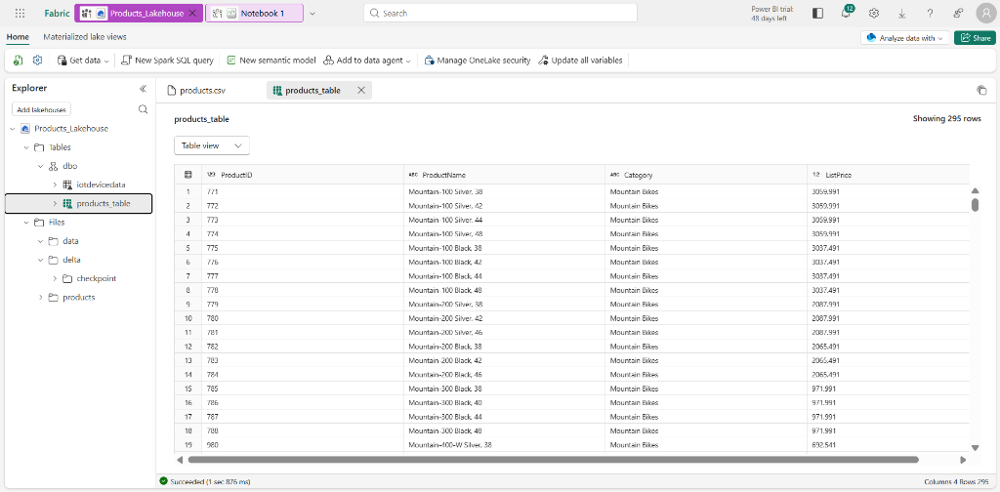
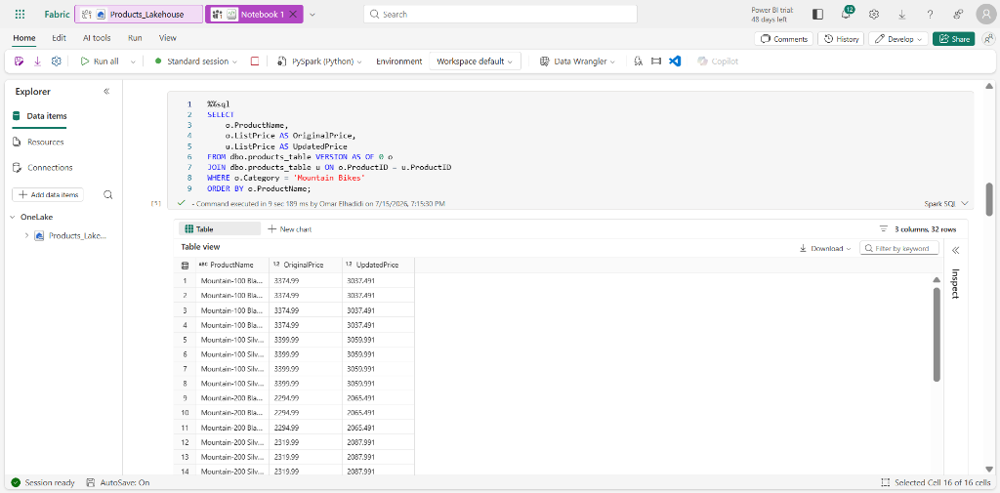
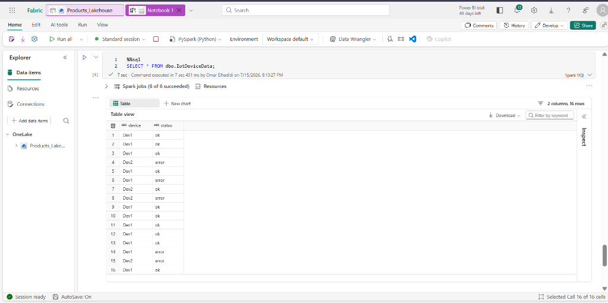

# 🧪 Exercise 8: Use Delta Tables in Apache Spark

This hands-on exercise explores Delta Lake capabilities inside Microsoft Fabric Spark Notebooks, including PySpark DataFrame loading with schemas, managed table creation, time travel version comparison queries, temporary views, and real-time streaming with Delta sinks.

---

## 1. Setup & Data Ingestion
1.  Download the data file: `https://github.com/MicrosoftLearning/dp-data/raw/main/products.csv`
2.  In your workspace `dp_workspace`, open the Lakehouse `delta_lakehouse`.
3.  Click `...` next to **Files**, select **New subfolder**, and create a folder named **`products`** (all lowercase).
4.  Upload `products.csv` into `Files/products/`.

---

## 2. Load Data & Create Delta Table
1.  Open a new Notebook and rename it.
2.  Load the CSV using a defined schema:
    ```python
    from pyspark.sql.types import StructType, IntegerType, StringType, DoubleType

    schema = StructType() \
        .add("ProductID", IntegerType(), True) \
        .add("ProductName", StringType(), True) \
        .add("Category", StringType(), True) \
        .add("ListPrice", DoubleType(), True)

    df = spark.read.format("csv").option("header","true").schema(schema).load("Files/products/products.csv")
    display(df)
    ```
3.  Save the DataFrame as a managed Delta table:
    ```python
    df.write.format("delta").saveAsTable("dbo.products_table")
    ```
    *   *Verification Output:*
        

---

## 3. Explore Time Travel
1.  Run a SQL cell to reduce Mountain Bike prices by 10%:
    ```sql
    %%sql
    UPDATE dbo.products_table
    SET ListPrice = ListPrice * 0.9
    WHERE Category = 'Mountain Bikes';
    ```
2.  Inspect the transaction log history:
    ```sql
    %%sql
    DESCRIBE HISTORY dbo.products_table;
    ```
3.  Compare the original prices (Version 0) and updated prices (Current Version) using a version join:
    ```sql
    %%sql
    SELECT
        o.ProductName,
        o.ListPrice AS OriginalPrice,
        u.ListPrice AS UpdatedPrice
    FROM dbo.products_table VERSION AS OF 0 o
    JOIN dbo.products_table u ON o.ProductID = u.ProductID
    WHERE o.Category = 'Mountain Bikes'
    ORDER BY o.ProductName;
    ```
    *   *Verification Output (Original vs. Updated prices comparison):*
        

---

## 4. Temporary Views & Analytics
1.  Create a temporary view summarizing price stats by category:
    ```sql
    %%sql
    CREATE OR REPLACE TEMPORARY VIEW products_view
    AS
        SELECT Category, COUNT(*) AS NumProducts, MIN(ListPrice) AS MinPrice, MAX(ListPrice) AS MaxPrice, AVG(ListPrice) AS AvgPrice
        FROM dp_workspace.delta_lakehouse.dbo.products_table
        GROUP BY Category;

    SELECT * FROM products_view ORDER BY Category;
    ```
2.  Query the top 10 categories and render the output as a bar chart using the **+ New chart** visual tool in the notebook cell.

---

## 5. IoT Stream Processing with Delta Sinks
1.  Initialize a streaming folder and ingest the initial JSON data:
    ```python
    from notebookutils import mssparkutils
    from pyspark.sql.types import *
    from pyspark.sql.functions import *

    inputPath = 'Files/data/'
    mssparkutils.fs.mkdirs(inputPath)

    jsonSchema = StructType([
        StructField("device", StringType(), False),
        StructField("status", StringType(), False)
    ])
    iotstream = spark.readStream.schema(jsonSchema).option("maxFilesPerTrigger", 1).json(inputPath)

    device_data = '''{"device":"Dev1","status":"ok"}
    {"device":"Dev1","status":"ok"}
    {"device":"Dev1","status":"ok"}
    {"device":"Dev2","status":"error"}
    {"device":"Dev1","status":"ok"}
    {"device":"Dev1","status":"error"}
    {"device":"Dev2","status":"ok"}
    {"device":"Dev2","status":"error"}
    {"device":"Dev1","status":"ok"}'''

    mssparkutils.fs.put(inputPath + "data.txt", device_data, True)
    ```
2.  Write the streaming data directly to a Delta table sink:
    ```python
    delta_stream_table_path = 'Tables/dbo/iotdevicedata'
    checkpointpath = 'Files/delta/checkpoint'
    deltastream = iotstream.writeStream.format("delta").option("checkpointLocation", checkpointpath).start(delta_stream_table_path)
    ```
3.  Query the streaming results:
    ```sql
    %%sql
    SELECT * FROM dbo.IotDeviceData;
    ```
    *   *Verification Output (IoT device records streamed in real-time):*
        
4.  Write more data to the streaming directory and re-query the table:
    ```python
    more_data = '''{"device":"Dev1","status":"ok"}
    {"device":"Dev1","status":"ok"}
    {"device":"Dev1","status":"ok"}
    {"device":"Dev1","status":"ok"}
    {"device":"Dev1","status":"error"}
    {"device":"Dev2","status":"error"}
    {"device":"Dev1","status":"ok"}'''

    mssparkutils.fs.put(inputPath + "more-data.txt", more_data, True)
    ```
5.  Stop the active stream query to release cluster resources:
    ```python
    deltastream.stop()
    ```

---

## 6. Verification Screenshots

### Delta Table Creation (`08_delta_creation.png`)


### Time Travel comparison (`08_time_travel.png`)


### IoT Delta Stream Sink (`08_iot_streaming.png`)

