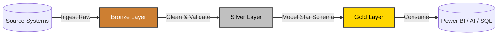

# 📚 Module 11: Organize a Fabric lakehouse using medallion architecture design

---

## 1. Module Overview & Objectives

*   **Goal:** Learn how to design and build a robust data catalog using the Medallion Architecture (Bronze, Silver, Gold layers) inside Microsoft Fabric Lakehouses.
*   **Key Objectives:**
    *   Identify the key decisions when planning a medallion architecture in Fabric.
    *   Describe how gold layer data is served for querying and reporting.
    *   Describe best practices for securing and governing medallion layers.

---

## 2. Introduction to Medallion Architecture

*   **The Enterprise Problem:** Organizations ingest a high variety of datasets (raw transactions, API logs, catalogs) at differing velocities. Failing to organize them results in massive data duplication, high cleaning overhead for analysts, and inconsistent reporting metrics.
*   **The Medallion Solution:** An industry-standard design pattern that organizes a data lakehouse into **three progressive layers (Bronze, Silver, and Gold)** to clean, validate, and enrich raw data systematically.
*   **Fabric Alignment:** This pattern maps natively onto Fabric OneLake using **Delta Lake tables**, providing ACID transactional reliability at every processing stage.

---

## 3. The Three Medallion Layers (Syllabus Core)

The medallion design pattern consists of three progressive processing stages, each optimized for different data consumer audiences.

### 🥉 1. Bronze Layer (Raw Storage)
*   **Purpose:** The raw landing zone and historical archive.
*   **Target Audience:** **Data Engineers**.
*   **Data State:** Data is kept in its native incoming format (CSV, JSON, XML, etc.) without schema modifications, conversions, or cleaning.
*   *Key Benefit (HIGH YIELD):* It acts as a safety buffer. If any downstream ETL step, logic rule, or calculation fails, engineers can reprocess all data starting from the Bronze layer instead of reloading it from the source system (preventing load overhead on operational databases).

### 🥈 2. Silver Layer (Cleansed & Integrated)
*   **Purpose:** The cleaned, structured enterprise single-source-of-truth.
*   **Target Audience:** **Data Analysts & Data Scientists**.
*   **Transformation Steps:**
    *   Enforcing data quality checks (replacing or removing null values).
    *   Deduplicating duplicate data logs.
    *   Combining/joining related entities from multiple distinct source systems.
    *   Standardizing data types (dates, text formatting).
*   **Data State:** Data is typically converted to standard **Delta Lake tables** for performance.

### 🥇 3. Gold Layer (Curated for Analytics)
*   **Purpose:** Business-level modeling optimized for consumption and reports.
*   **Target Audience:** **Business Users, Dashboards (Power BI), and AI**.
*   **Structure:** Typically modeled using a **Star Schema** consisting of **Fact tables** (numeric metrics/keys) and **Dimension tables** (descriptive business lookup attributes).
*   **Data State:** Aggregated, formatted, and optimized for maximum read performance.

### ⚙️ Adaptability Rule
*   *Flexibility:* The 3-layer pattern is a guideline. You can add custom landing staging folders before Bronze, or domain-specific database views after Gold. What matters is that **every layer has a defined purpose and designated audience**.

---

## 4. Planning & Implementing Medallion in Fabric (HIGH YIELD)

Implementing a medallion architecture requires designing workspace layout, selecting transformation tools, and serving curated data.

### 🗺️ 1. Lakehouse Structure Decisions (Topology)

| Topology | Best For | Trade-offs / Detail |
|---|---|---|
| **Single Lakehouse with Schemas** | Smaller teams, fast startups, early projects. | Tables are organized under distinct schemas: `bronze`, `silver`, and `gold`. Simplifies maintenance and allows schema-level permissions. |
| **Separate Lakehouses** | Teams needing separation of duties. | Distinct lakehouses for each layer. Clean separation of item-level permissions. |
| **Separate Workspaces** | Strict regulatory, compliance, or billing separation. | Strongest isolation, but increases setup and cross-workspace orchestration complexity. |

### 📥 2. Bronze Ingestion Strategy
*   *Cloud Sources:* If source data already lives in cloud stores (OneLake, ADLS Gen2, AWS S3, Google Cloud Storage), use **OneLake Shortcuts** to query in-place. This completely avoids copying files or coding pipelines.
*   *Other Sources:* Use Data Factory Pipelines, Dataflows Gen2, or Notebooks to load data.

### 🔄 3. Silver Layer Transformation Tools
*   **Dataflows Gen2 (Low-Code):** Best for visual transformations (filters, renaming, simple joins).
*   **Spark Notebooks (Code-First):** Best for massive datasets, complex joins, Python logic, and custom ML.
*   **Materialized Lake Views (CRITICAL EXAM CONCEPT):**
    *   *What it is:* A view written in SQL that **physically writes and saves the results to disk as a Delta table**.
    *   *How it works (Incremental Syncing):* Fabric uses the source table's Delta transaction log to track changes. When new data arrives in Bronze, Fabric automatically synchronizes and updates **only the changed or new rows** in the Silver table.
    *   *Benefits:* No execution scheduling or pipelines are required to keep the view updated.
    *   *Limitation:* The transformation logic must be expressible entirely in standard SQL.

### 🏆 4. Gold Layer & Consumption
*   **Modeling Shapes:** Typically Star Schemas (Fact/Dim), but can be modeled as wide tables for Data Science or pre-aggregated tables for finance.
*   **Alternative Gold Engines:** If the organization is heavily SQL-centric, a **Fabric Data Warehouse** can serve as the Gold layer instead of a Lakehouse.
*   **End-User Access:**
    *   *SQL analysts:* Query Delta tables directly via the **SQL analytics endpoint** using read-only T-SQL.
    *   *Business users:* Connect via a **Power BI semantic model** utilizing Direct Lake mode.

---

## 5. Querying & Reporting on Gold Layer Data

### 🛢️ SQL Analytics Endpoint
*   **Access Mode:** Read-only T-SQL over all lakehouse Delta tables (bronze, silver, and gold schemas are all visible).
*   **Capabilities:** Write queries, save reusable functions, create views, and apply row/column-level security — all without copying or moving data.
*   **Who uses it:** Data analysts and SQL-literate business users who need ad-hoc querying over the curated gold tables.

### 📊 Power BI Semantic Model (HIGH YIELD)
*   **Creation:** Select **New semantic model** from the lakehouse UI, then choose which gold layer tables to include.
*   **Connection Mode:** Uses **Direct Lake mode** by default — reads directly from the Delta Parquet files in OneLake.
*   **Key Benefits:**
    *   Reports always show **current data** without a separate scheduled refresh step.
    *   No data import or duplication into Power BI cloud memory.
*   **Consumer Separation:** Business users connect to the **semantic model**, never to the raw Delta tables directly. This enforces a clean abstraction between engineering and reporting.

---

## 6. Security & Governance for Medallion Lakehouses (HIGH YIELD)

### 🔐 Access Control — Two Levels

#### Level 1: Workspace & Item Permissions
*   **Workspace Roles** (Admin, Member, Contributor, Viewer) apply to **everything** in that workspace.
*   **Item Permissions** are more targeted — share a specific lakehouse with a colleague without exposing the entire workspace.
*   **Strongest Isolation:** Place each medallion layer (Bronze, Silver, Gold) in its **own workspace** for separate capacity, role assignments, and ownership boundaries.

#### Level 2: OneLake Data Access Roles (CRITICAL EXAM CONCEPT)
*   Provides **granular, table/folder-level** access control **within a single lakehouse** — no separate workspaces needed.
*   You can scope a role so a Gold consumer can query `gold.*` tables but cannot see `bronze.*` or `silver.*` tables at all.
*   **DefaultReader Role:** Every lakehouse ships with a built-in `DefaultReader` role that grants all `ReadAll` users access to **all** data. You must **modify or delete it** to actually restrict access.
*   **Configuration:** Open the lakehouse → **Manage OneLake security** → Create role → Define scope → Assign members.

| Approach | When to Use |
|---|---|
| **OneLake Data Access Roles** | Teams sharing a single workspace who need different table-level access per layer. |
| **Separate Workspaces per Layer** | Strong isolation, compliance/regulatory boundaries, or separate capacity billing required. |

### 🔄 Change Management with Git
*   **Why It Matters:** Medallion architectures involve interdependent code (pipelines, notebooks, schema definitions). A bad deployment can corrupt data mid-layer with no easy rollback without version control.
*   **Fabric Git Integration:** Connects your workspace to a Git repository. Notebooks, pipelines, and lakehouse definitions are all versioned together. If a Silver layer transformation breaks, you **revert to the previous commit**.
*   **Branching & PRs:** Teams work in feature branches and merge through pull requests — same workflow as application code development.

### 🚀 Deployment Pipelines
*   Extend Git workflows by promoting your medallion workspace through stages: **Development → Test → Production**.
*   Compare environments side-by-side and catch configuration differences **before** they reach production data.

---

## 7. Module Summary — Quick Recall Cheat Sheet

| Concept | Key Detail |
|---|---|
| **Bronze Layer** | Raw landing zone. No transformations. Permanent source of truth for reprocessing. |
| **Silver Layer** | Clean, deduplicate, standardize, join. Reliable integrated dataset for analysts & data scientists. |
| **Gold Layer** | Business-modeled (star schema, flat tables, aggregates). Shaped per audience. |
| **Schema Organization** | Use `bronze`, `silver`, `gold` schemas within a single lakehouse to group tables by layer. |
| **OneLake Shortcuts** | Reference cloud storage (ADLS Gen2, S3, GCS) in-place without copying — ideal for Bronze ingestion. |
| **Materialized Lake Views** | SQL-defined views that physically save results as Delta tables with automatic incremental refresh. |
| **Direct Lake Mode** | Power BI reads Delta files directly from OneLake — no import copy, always current data. |
| **OneLake Data Access Roles** | Granular table/folder-level permissions within a single lakehouse. Must modify/delete `DefaultReader` to restrict access. |
| **Git Integration** | Version pipelines, notebooks, and schemas together. Revert bad deployments with a commit rollback. |
| **Deployment Pipelines** | Promote workspaces: Dev → Test → Production with environment comparison. |

