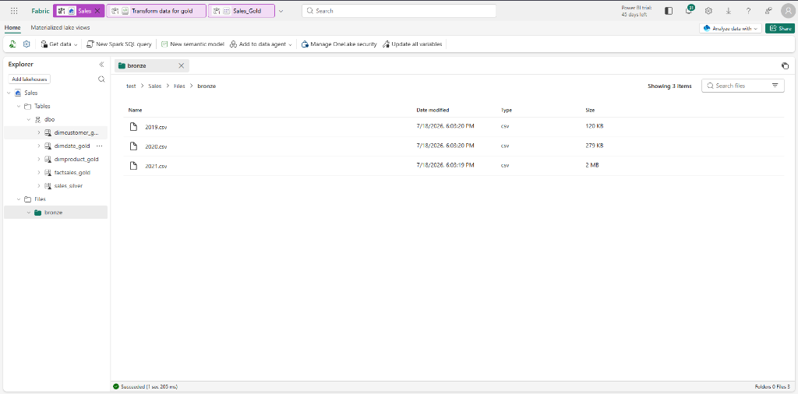
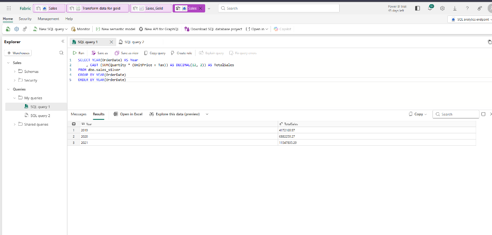
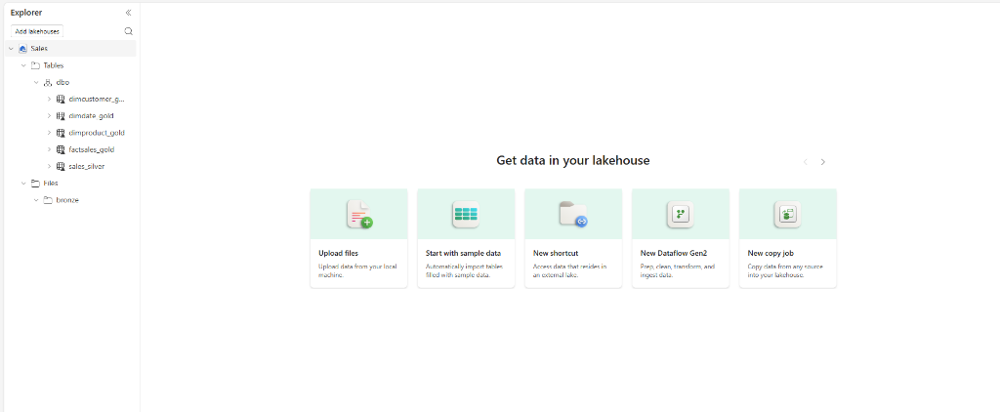
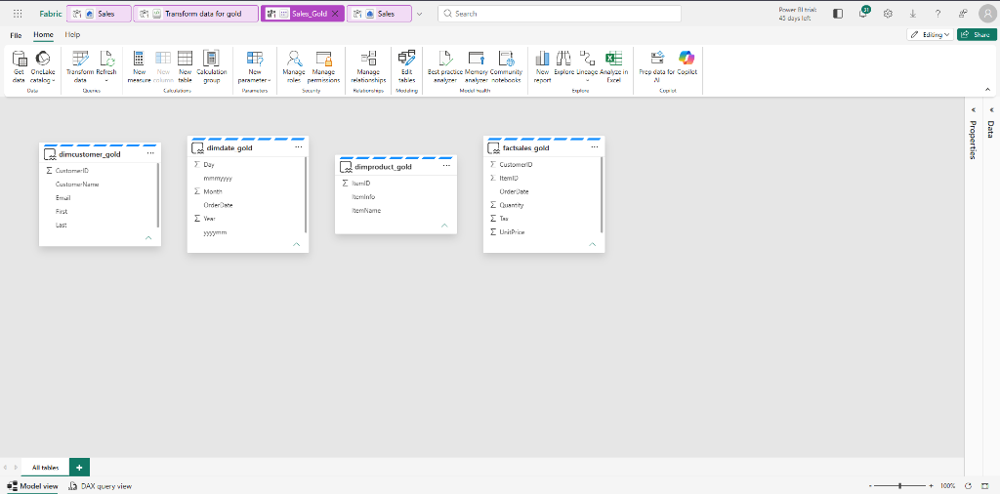

# 🧪 Exercise 11: Create a Medallion Architecture in a Microsoft Fabric Lakehouse

This hands-on exercise builds a full Bronze → Silver → Gold medallion architecture using Spark notebooks. You'll ingest raw CSV files, clean and upsert data into a Silver Delta table, then model a star schema (dimDate, dimCustomer, dimProduct, factSales) in the Gold layer.

---

## 1. Setup & Bronze Layer Ingestion

1.  Create a new workspace with Fabric capacity.
2.  Create a new Lakehouse named **`Sales`** (leave Lakehouse schemas selected).
3.  Download `orders.zip` from: `https://github.com/MicrosoftLearning/dp-data/blob/main/orders.zip`
4.  Extract the 3 files: `2019.csv`, `2020.csv`, `2021.csv`.
5.  In the Explorer pane, create a **New subfolder** under `Files/` named **`bronze`**.
6.  Upload all 3 CSV files into `Files/bronze/`.

---

## 2. Transform Data → Silver Layer

Open a new notebook and rename it to **"Transform data for Silver"**.

### Cell 1: Load Bronze CSVs with Schema

```python
from pyspark.sql.types import *

# Create the schema for the table
orderSchema = StructType([
    StructField("SalesOrderNumber", StringType()),
    StructField("SalesOrderLineNumber", IntegerType()),
    StructField("OrderDate", DateType()),
    StructField("CustomerName", StringType()),
    StructField("Email", StringType()),
    StructField("Item", StringType()),
    StructField("Quantity", IntegerType()),
    StructField("UnitPrice", FloatType()),
    StructField("Tax", FloatType())
])

# Import all files from bronze folder of lakehouse
df = spark.read.format("csv").option("header", "false").schema(orderSchema).load("Files/bronze/*.csv")

# Display the first 10 rows of the dataframe to preview your data
display(df.head(10))
```

### Cell 2: Add Audit Columns & Clean CustomerName

```python
from pyspark.sql.functions import when, lit, col, current_timestamp, input_file_name

# Add columns IsFlagged, CreatedTS and ModifiedTS
df = df.withColumn("FileName", input_file_name()) \
    .withColumn("IsFlagged", when(col("OrderDate") < '2019-08-01',True).otherwise(False)) \
    .withColumn("CreatedTS", current_timestamp()).withColumn("ModifiedTS", current_timestamp())

# Update CustomerName to "Unknown" if CustomerName null or empty
df = df.withColumn("CustomerName", when((col("CustomerName").isNull() | (col("CustomerName")=="")),lit("Unknown")).otherwise(col("CustomerName")))
```

### Cell 3: Create Silver Delta Table Schema

```python
from pyspark.sql.types import *
from delta.tables import *

DeltaTable.createIfNotExists(spark) \
    .tableName("sales.dbo.sales_silver") \
    .addColumn("SalesOrderNumber", StringType()) \
    .addColumn("SalesOrderLineNumber", IntegerType()) \
    .addColumn("OrderDate", DateType()) \
    .addColumn("CustomerName", StringType()) \
    .addColumn("Email", StringType()) \
    .addColumn("Item", StringType()) \
    .addColumn("Quantity", IntegerType()) \
    .addColumn("UnitPrice", FloatType()) \
    .addColumn("Tax", FloatType()) \
    .addColumn("FileName", StringType()) \
    .addColumn("IsFlagged", BooleanType()) \
    .addColumn("CreatedTS", DateType()) \
    .addColumn("ModifiedTS", DateType()) \
    .execute()
```

### Cell 4: Upsert (MERGE) into Silver Table

```python
from delta.tables import *

deltaTable = DeltaTable.forPath(spark, 'Tables/dbo/sales_silver')

dfUpdates = df

deltaTable.alias('silver') \
  .merge(
    dfUpdates.alias('updates'),
    'silver.SalesOrderNumber = updates.SalesOrderNumber and silver.OrderDate = updates.OrderDate and silver.CustomerName = updates.CustomerName and silver.Item = updates.Item'
  ) \
   .whenMatchedUpdate(set =
    {

    }
  ) \
 .whenNotMatchedInsert(values =
    {
      "SalesOrderNumber": "updates.SalesOrderNumber",
      "SalesOrderLineNumber": "updates.SalesOrderLineNumber",
      "OrderDate": "updates.OrderDate",
      "CustomerName": "updates.CustomerName",
      "Email": "updates.Email",
      "Item": "updates.Item",
      "Quantity": "updates.Quantity",
      "UnitPrice": "updates.UnitPrice",
      "Tax": "updates.Tax",
      "FileName": "updates.FileName",
      "IsFlagged": "updates.IsFlagged",
      "CreatedTS": "updates.CreatedTS",
      "ModifiedTS": "updates.ModifiedTS"
    }
  ) \
  .execute()
```

**⚠️ Stop the Spark session** after running all Silver cells (Run tab → Stop session).

---

## 3. Explore Silver Layer via SQL Analytics Endpoint

1.  Navigate to your workspace and open the **Sales SQL analytics endpoint**.
2.  Run the following SQL queries:

### Query 1: Total Sales by Year

```sql
SELECT YEAR(OrderDate) AS Year
    , CAST (SUM(Quantity * (UnitPrice + Tax)) AS DECIMAL(12, 2)) AS TotalSales
FROM dbo.sales_silver
GROUP BY YEAR(OrderDate)
ORDER BY YEAR(OrderDate)
```

### Query 2: Top 10 Customers by Quantity

```sql
SELECT TOP (10) CustomerName, SUM(Quantity) AS TotalQuantity
FROM dbo.sales_silver
GROUP BY CustomerName
ORDER BY TotalQuantity DESC
```

---

## 4. Transform Data → Gold Layer (Star Schema)

Create a **new notebook** named **"Transform data for Gold"** and attach the **Sales** lakehouse.

### Cell 1: Load Silver Data

```python
df = spark.read.table("Sales.dbo.sales_silver")
```

### Cell 2: Create dimdate_gold Table Schema

```python
from pyspark.sql.types import *
from delta.tables import*

DeltaTable.createIfNotExists(spark) \
    .tableName("sales.dbo.dimdate_gold") \
    .addColumn("OrderDate", DateType()) \
    .addColumn("Day", IntegerType()) \
    .addColumn("Month", IntegerType()) \
    .addColumn("Year", IntegerType()) \
    .addColumn("mmmyyyy", StringType()) \
    .addColumn("yyyymm", StringType()) \
    .execute()
```

### Cell 3: Populate dimDate DataFrame

```python
from pyspark.sql.functions import col, dayofmonth, month, year, date_format

dfdimDate_gold = df.dropDuplicates(["OrderDate"]).select(col("OrderDate"), \
        dayofmonth("OrderDate").alias("Day"), \
        month("OrderDate").alias("Month"), \
        year("OrderDate").alias("Year"), \
        date_format(col("OrderDate"), "MMM-yyyy").alias("mmmyyyy"), \
        date_format(col("OrderDate"), "yyyyMM").alias("yyyymm"), \
    ).orderBy("OrderDate")

display(dfdimDate_gold.head(10))
```

### Cell 4: Upsert dimDate

```python
from delta.tables import *

deltaTable = DeltaTable.forPath(spark, 'Tables/dbo/dimdate_gold')
dfUpdates = dfdimDate_gold

deltaTable.alias('gold') \
  .merge(
    dfUpdates.alias('updates'),
    'gold.OrderDate = updates.OrderDate'
  ) \
   .whenMatchedUpdate(set = {}) \
 .whenNotMatchedInsert(values =
    {
      "OrderDate": "updates.OrderDate",
      "Day": "updates.Day",
      "Month": "updates.Month",
      "Year": "updates.Year",
      "mmmyyyy": "updates.mmmyyyy",
      "yyyymm": "updates.yyyymm"
    }
  ) \
  .execute()
```

### Cell 5: Create dimcustomer_gold Table Schema

```python
from pyspark.sql.types import *
from delta.tables import *

DeltaTable.createIfNotExists(spark) \
    .tableName("sales.dbo.dimcustomer_gold") \
    .addColumn("CustomerName", StringType()) \
    .addColumn("Email",  StringType()) \
    .addColumn("First", StringType()) \
    .addColumn("Last", StringType()) \
    .addColumn("CustomerID", LongType()) \
    .execute()
```

### Cell 6: Build Customer Silver DataFrame

```python
from pyspark.sql.functions import col, split

dfdimCustomer_silver = df.dropDuplicates(["CustomerName","Email"]).select(col("CustomerName"),col("Email")) \
    .withColumn("First",split(col("CustomerName"), " ").getItem(0)) \
    .withColumn("Last",split(col("CustomerName"), " ").getItem(1))

display(dfdimCustomer_silver.head(10))
```

### Cell 7: Generate Customer IDs (left_anti join)

```python
from pyspark.sql.functions import monotonically_increasing_id, col, when, coalesce, max, lit

dfdimCustomer_temp = spark.read.table("Sales.dbo.dimCustomer_gold")

MAXCustomerID = dfdimCustomer_temp.select(coalesce(max(col("CustomerID")),lit(0)).alias("MAXCustomerID")).first()[0]

dfdimCustomer_gold = dfdimCustomer_silver.join(dfdimCustomer_temp,(dfdimCustomer_silver.CustomerName == dfdimCustomer_temp.CustomerName) & (dfdimCustomer_silver.Email == dfdimCustomer_temp.Email), "left_anti")

dfdimCustomer_gold = dfdimCustomer_gold.withColumn("CustomerID",monotonically_increasing_id() + MAXCustomerID + 1)

display(dfdimCustomer_gold.head(10))
```

### Cell 8: Upsert dimCustomer

```python
from delta.tables import *

deltaTable = DeltaTable.forPath(spark, 'Tables/dbo/dimcustomer_gold')
dfUpdates = dfdimCustomer_gold

deltaTable.alias('gold') \
  .merge(
    dfUpdates.alias('updates'),
    'gold.CustomerName = updates.CustomerName AND gold.Email = updates.Email'
  ) \
   .whenMatchedUpdate(set = {}) \
 .whenNotMatchedInsert(values =
    {
      "CustomerName": "updates.CustomerName",
      "Email": "updates.Email",
      "First": "updates.First",
      "Last": "updates.Last",
      "CustomerID": "updates.CustomerID"
    }
  ) \
  .execute()
```

### Cell 9: Create dimproduct_gold Table Schema

```python
from pyspark.sql.types import *
from delta.tables import *

DeltaTable.createIfNotExists(spark) \
    .tableName("sales.dbo.dimproduct_gold") \
    .addColumn("ItemName", StringType()) \
    .addColumn("ItemID", LongType()) \
    .addColumn("ItemInfo", StringType()) \
    .execute()
```

### Cell 10: Build Product Silver DataFrame

```python
from pyspark.sql.functions import col, split, lit, when

dfdimProduct_silver = df.dropDuplicates(["Item"]).select(col("Item")) \
    .withColumn("ItemName",split(col("Item"), ", ").getItem(0)) \
    .withColumn("ItemInfo",when((split(col("Item"), ", ").getItem(1).isNull() | (split(col("Item"), ", ").getItem(1)=="")),lit("")).otherwise(split(col("Item"), ", ").getItem(1)))

display(dfdimProduct_silver.head(10))
```

### Cell 11: Generate Product IDs

```python
from pyspark.sql.functions import monotonically_increasing_id, col, lit, max, coalesce

dfdimProduct_temp = spark.read.table("Sales.dbo.dimProduct_gold")

MAXProductID = dfdimProduct_temp.select(coalesce(max(col("ItemID")),lit(0)).alias("MAXItemID")).first()[0]

dfdimProduct_gold = dfdimProduct_silver.join(dfdimProduct_temp,(dfdimProduct_silver.ItemName == dfdimProduct_temp.ItemName) & (dfdimProduct_silver.ItemInfo == dfdimProduct_temp.ItemInfo), "left_anti")

dfdimProduct_gold = dfdimProduct_gold.withColumn("ItemID",monotonically_increasing_id() + MAXProductID + 1)

display(dfdimProduct_gold.head(10))
```

### Cell 12: Upsert dimProduct

```python
from delta.tables import *

deltaTable = DeltaTable.forPath(spark, 'Tables/dbo/dimproduct_gold')
dfUpdates = dfdimProduct_gold

deltaTable.alias('gold') \
  .merge(
    dfUpdates.alias('updates'),
    'gold.ItemName = updates.ItemName AND gold.ItemInfo = updates.ItemInfo'
  ) \
   .whenMatchedUpdate(set = {}) \
 .whenNotMatchedInsert(values =
    {
      "ItemName": "updates.ItemName",
      "ItemInfo": "updates.ItemInfo",
      "ItemID": "updates.ItemID"
    }
  ) \
  .execute()
```

### Cell 13: Create factsales_gold Table Schema

```python
from pyspark.sql.types import *
from delta.tables import *

DeltaTable.createIfNotExists(spark) \
    .tableName("sales.dbo.factsales_gold") \
    .addColumn("CustomerID", LongType()) \
    .addColumn("ItemID", LongType()) \
    .addColumn("OrderDate", DateType()) \
    .addColumn("Quantity", IntegerType()) \
    .addColumn("UnitPrice", FloatType()) \
    .addColumn("Tax", FloatType()) \
    .execute()
```

### Cell 14: Build Fact Sales DataFrame (Join Dims)

```python
from pyspark.sql.functions import col

dfdimCustomer_temp = spark.read.table("Sales.dbo.dimCustomer_gold")
dfdimProduct_temp = spark.read.table("Sales.dbo.dimProduct_gold")

df = df.withColumn("ItemName",split(col("Item"), ", ").getItem(0)) \
    .withColumn("ItemInfo",when((split(col("Item"), ", ").getItem(1).isNull() | (split(col("Item"), ", ").getItem(1)=="")),lit("")).otherwise(split(col("Item"), ", ").getItem(1))) \

# Create Sales_gold dataframe
dffactSales_gold = df.alias("df1").join(dfdimCustomer_temp.alias("df2"),(df.CustomerName == dfdimCustomer_temp.CustomerName) & (df.Email == dfdimCustomer_temp.Email), "left") \
        .join(dfdimProduct_temp.alias("df3"),(df.ItemName == dfdimProduct_temp.ItemName) & (df.ItemInfo == dfdimProduct_temp.ItemInfo), "left") \
    .select(col("df2.CustomerID") \
        , col("df3.ItemID") \
        , col("df1.OrderDate") \
        , col("df1.Quantity") \
        , col("df1.UnitPrice") \
        , col("df1.Tax") \
    ).orderBy(col("df1.OrderDate"), col("df2.CustomerID"), col("df3.ItemID"))

display(dffactSales_gold.head(10))
```

### Cell 15: Upsert factSales

```python
from delta.tables import *

deltaTable = DeltaTable.forPath(spark, 'Tables/dbo/factsales_gold')
dfUpdates = dffactSales_gold

deltaTable.alias('gold') \
  .merge(
    dfUpdates.alias('updates'),
    'gold.OrderDate = updates.OrderDate AND gold.CustomerID = updates.CustomerID AND gold.ItemID = updates.ItemID'
  ) \
   .whenMatchedUpdate(set = {}) \
 .whenNotMatchedInsert(values =
    {
      "CustomerID": "updates.CustomerID",
      "ItemID": "updates.ItemID",
      "OrderDate": "updates.OrderDate",
      "Quantity": "updates.Quantity",
      "UnitPrice": "updates.UnitPrice",
      "Tax": "updates.Tax"
    }
  ) \
  .execute()
```

---

## 5. (Optional) Create a Semantic Model

1.  Navigate to the **Sales** lakehouse.
2.  Select **New semantic model** from the ribbon.
3.  Name it **`Sales_Gold`**.
4.  Select the 4 gold tables: `dimdate_gold`, `dimcustomer_gold`, `dimproduct_gold`, `factsales_gold`.
5.  Define relationships between fact and dimension tables in the model designer.

---

## 6. Verification Screenshots

### Bronze Files Uploaded (`11_bronze_layer.png`)
*   *Verification:* Shows 2019.csv, 2020.csv, 2021.csv inside Files/bronze/


### Silver Table & SQL Query (`11_silver_query.png`)
*   *Verification:* Shows SQL analytics endpoint query on sales_silver (Total Sales by Year)


### Gold Star Schema Tables (`11_gold_tables.png`)
*   *Verification:* Shows all 4 gold tables (dimdate, dimcustomer, dimproduct, factsales) in Lakehouse Explorer


### Semantic Model Relationships (`11_semantic_model.png`)
*   *Verification:* Shows the star schema relationships in the semantic model designer

