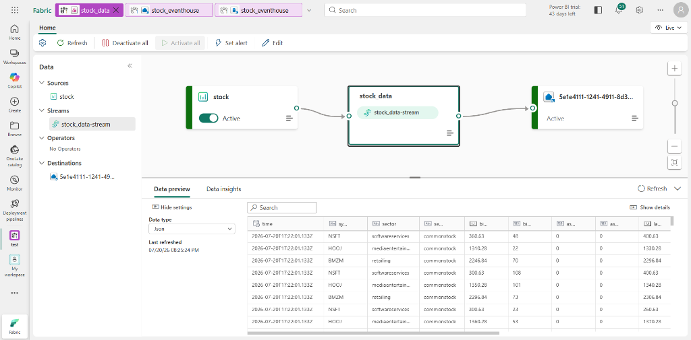
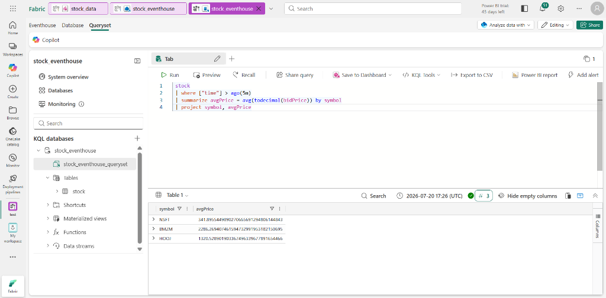
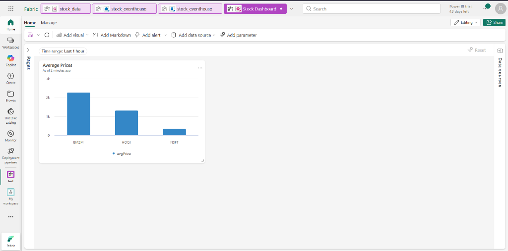
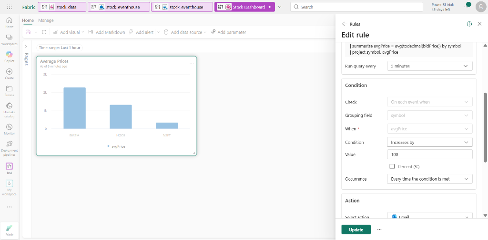

# 🧪 Exercise 11: Get Started with Real-Time Intelligence in Microsoft Fabric

This hands-on lab covers end-to-end Real-Time Intelligence (RTI) in Microsoft Fabric: ingesting real-time stock market data via Eventstream, storing it in an Eventhouse KQL database, running KQL queries, building a Real-Time Dashboard, and setting up an Activator alert.

---

## 1. Setup & Ingestion via Eventstream

1. Navigate to **Real-Time Hub** from the left navigation menu bar in Fabric.
2. Select **Add data** -> Choose **Stock market** sample data source.
3. Configure the source:
   * **Source name:** `stock`
   * **Workspace:** Your workspace
   * **Eventstream name:** `stock-data`
   * *(Default stream name: `stock-data-stream`)*
4. Click **Next** -> **Connect** -> Select **Open eventstream**.
5. Observe the stock source connected to `stock-data-stream` on the canvas.

---

## 2. Eventhouse & Database Table Creation

1. Select **Create** from the left menu bar -> Under *Real-Time Intelligence*, select **Eventhouse**.
2. Name the Eventhouse (e.g., `StockEventhouse`).
3. Open your Eventhouse -> Select the automatically created default KQL database.
4. On the database page, select **Get data**.
5. Select **Eventstream** -> **Existing eventstream**.
6. Configure destination table:
   * **Destination table name:** `stock` (Create new)
   * **Workspace:** Your workspace
   * **Eventstream:** `stock-data`
   * **Connection name:** `stock-table`
7. Complete the inspection wizard to finish configuration.
8. Re-open `stock-data` in Eventstream to verify that `stock` table appears as a green destination node.

   * 📸 **Screenshot Checkpoint 1 (`11_eventstream_destination.png`):** Capture the Eventstream canvas showing the `stock` source -> `stock-data-stream` -> `stock` table destination node.
     

---

## 3. Query Captured Data with KQL

1. Open your KQL Database -> Click on the associated **KQL Queryset**.
2. Run basic query to inspect rows:
   ```kql
   stock
   | take 100
   ```
3. Run time-series aggregation query (calculates 5-minute rolling average bid price per stock symbol):
   ```kql
   stock
   | where ["time"] > ago(5m)
   | summarize avgPrice = avg(todecimal(bidPrice)) by symbol
   | project symbol, avgPrice
   ```
4. Re-run after a few seconds to verify `avgPrice` updates dynamically as new streaming events land.

   * 📸 **Screenshot Checkpoint 2 (`11_kql_query_result.png`):** Capture the KQL Queryset window showing the query execution and the output table of stock symbols and `avgPrice`.
     

---

## 4. Build a Real-Time Dashboard

1. Highlight the 5-minute average price KQL query in the query editor.
2. On the toolbar, select **Save to dashboard** -> Pin to a **New dashboard**:
   * **Dashboard name:** `Stock Dashboard`
   * **Tile name:** `Average Prices`
3. Open `Stock Dashboard` -> Switch from *Viewing mode* to *Editing mode*.
4. Edit the `Average Prices` tile:
   * Change **Visual type** from `Table` to **`Column chart`**.
5. Select **Apply changes**.

   * 📸 **Screenshot Checkpoint 3 (`11_realtime_dashboard.png`):** Capture the published Real-Time Dashboard displaying the live column chart of average stock prices.
     

---

## 5. Automate Alerting with Activator

1. On the dashboard toolbar, select **Set alert**.
2. Configure the Activator alert rule:
   * **Run query every:** `5 minutes`
   * **Check:** `On each event grouped by`
   * **Grouping field:** `symbol`
   * **When:** `avgPrice`
   * **Condition:** `Increases by`
   * **Value:** `100`
   * **Action:** `Send me an email`
   * **Save location:** Create a new item (e.g., `StockPriceAlertActivator`)
3. Save the alert and navigate to your workspace items.
4. Open the Activator item -> Select the alert under the `avgPrice` node -> View the **History** tab.

   * 📸 **Screenshot Checkpoint 4 (`11_activator_alert.png`):** Capture the Activator rule design page showing the trigger condition (`avgPrice increases by 100`) and the alert history pane.
     
